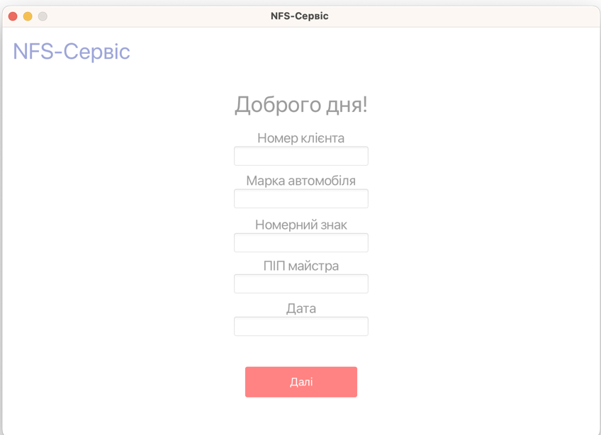
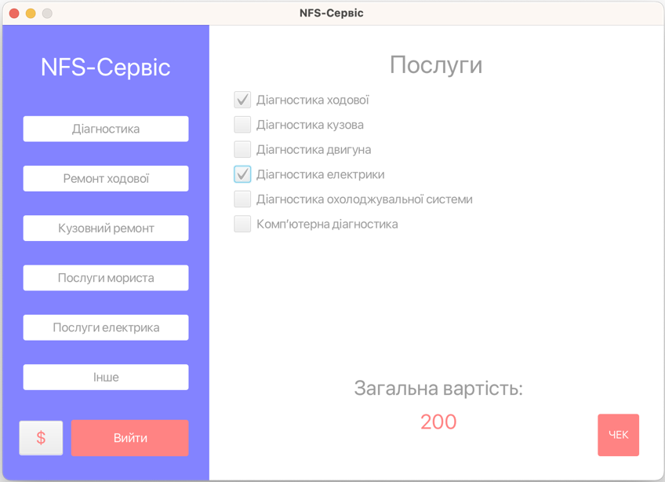
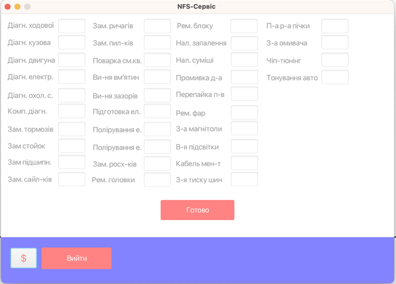
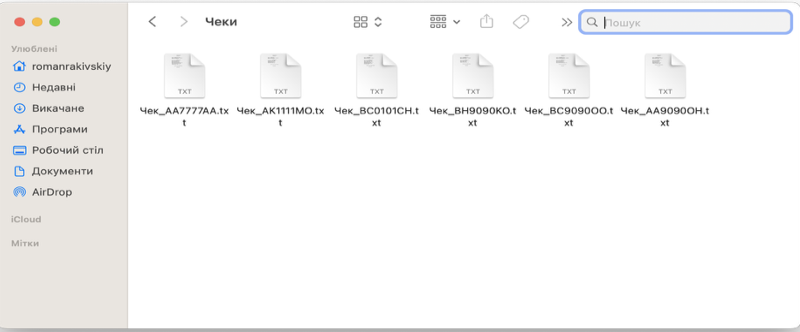

# 🚗 Курсова робота з Java: Система фіскальної звітності для «NFS-Сервіс»

## 📌 Актуальність теми

Актуальність полягає у створенні зручного програмного забезпечення для станції технічного обслуговування, а саме компанії **«NFS-Сервіс»**, з метою автоматизації звітності виконаних робіт у вигляді **фіскальних чеків**.

## 🎯 Мета роботи

- Закріпити знання з проєктування та розробки програмного забезпечення на мові **Java**.
- Ознайомитись із роботою з **графічним інтерфейсом користувача (JavaFX + SceneBuilder)**.
- Освоїти взаємодію з **текстовими файлами** для зчитування та запису даних.

## 🔍 Об'єкт та предмет дослідження

- **Об'єкт дослідження:** Компоненти та методи Java, які дозволяють працювати з текстовими файлами — їх створення, зчитування, редагування.
- **Предмет дослідження:** Методи обробки текстових файлів у **Java**, розробка GUI в середовищі **SceneBuilder**, використання **.fxml**-файлів.

## 🧩 Основний функціонал програми

- Зчитування актуальних цін з текстового файлу.
- Додавання записів про виконані роботи у нові файли.
- Генерація звітів та фіскальних чеків.
- Інтерфейс користувача з використанням **JavaFX** та SceneBuilder.

## 🛠️ Технології

- Java (IntelliJ IDEA Community Edition)
- JavaFX + SceneBuilder
- Робота з файлами (`BufferedReader`, `FileWriter` тощо)
- Форматування тексту, перевірка вхідних даних

## 🖼️ Інтерфейс

Приклад інтерфейсу програми:

